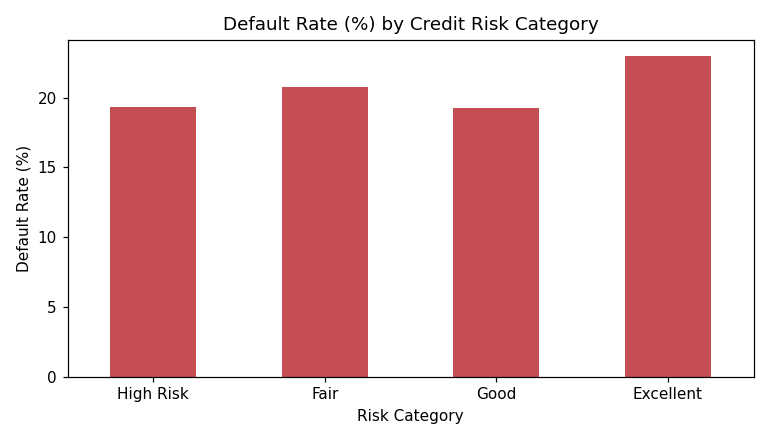
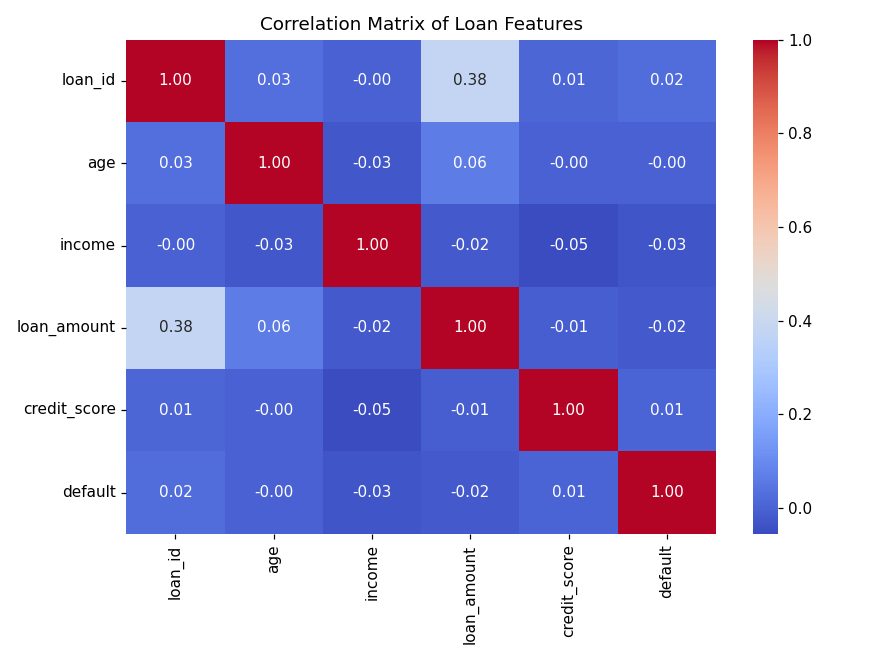
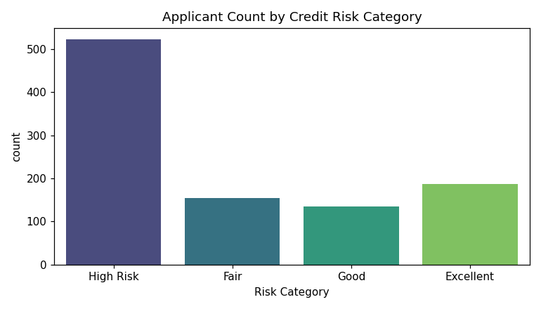

# 💳 Loan Risk Analysis & Feature Engineering

### Data Cleaning • Exploratory Data Analysis • Feature Engineering • Credit Risk Segmentation

<p align="center">
  
</p>

<p align="center">
  
  
  
  
  
  
  
</p>

---

## 📖 Table of Contents

- [Project Description](#-project-description)
- [Business Problem](#-business-problem)
- [Project Objectives](#-project-objectives)
- [Dataset Overview](#-dataset-overview)
- [Key Features](#-key-features)
- [Workflow](#-workflow)
- [Technologies Used](#-technologies-used)
- [Project Structure](#-project-structure)
- [Installation](#-installation)
- [How to Run](#-how-to-run)
- [Notebook Walkthrough](#-notebook-walkthrough)
- [Exploratory Data Analysis](#-exploratory-data-analysis)
- [Key Insights](#-key-insights)
- [Business Recommendations](#-business-recommendations)
- [Limitations & Honest Findings](#-limitations--honest-findings)
- [Future Improvements](#-future-improvements)
- [Screenshots](#-screenshots)
- [Results Summary](#-results-summary)
- [Conclusion](#-conclusion)
- [License](#-license)
- [Author](#-author)
- [Acknowledgements](#-acknowledgements)

---

## 📝 Project Description

This project performs an end-to-end **data cleaning, exploratory data analysis (EDA), and feature engineering** pipeline on a synthetic **loan applicant dataset**, with the goal of understanding which applicant characteristics are associated with **loan default risk**. It simulates a real-world task performed by data analysts and data scientists at banks, NBFCs, and fintech lending platforms: turning raw, messy applicant data into structured, model-ready features that support **credit risk assessment**.

The project demonstrates practical, industry-relevant skills — missing value imputation, outlier treatment, correlation analysis, ratio-based feature engineering, and categorical risk segmentation — using a clean, well-commented Jupyter Notebook.

---

## 💼 Business Problem

Lenders (banks, microfinance institutions, and fintech loan platforms) need to estimate the probability that a borrower will **default** on a loan **before** the loan is approved. Poor risk assessment leads to two costly outcomes:

1. **Approving high-risk borrowers** → increased default losses.
2. **Rejecting low-risk borrowers** → lost revenue and poor customer experience.

This project builds the **foundational data layer** for that decision — cleaning applicant records and engineering features (like Debt-to-Income ratio and credit-score-based risk bands) that a downstream credit-scoring model or underwriting rules engine would consume.

---

## 🎯 Project Objectives

- Load and audit a raw loan applicant dataset for data quality issues.
- Handle missing values without distorting the underlying data distribution.
- Detect and treat outliers in loan amounts using percentile-based clipping.
- Engineer a **Debt-to-Income (DTI) Ratio** feature from existing fields.
- Segment applicants into **credit risk categories** using industry-standard credit score bands.
- Analyze default rates across risk segments to validate (or challenge) the engineered features.
- Package the entire workflow as a reproducible, professional, open-source project.

---

## 📊 Dataset Overview

| Property | Value |
|---|---|
| **File** | `loan_data.csv` |
| **Rows** | 1,000 loan applicants |
| **Columns** | 6 |
| **Missing Values** | 51 missing entries in `income` (5.1%) |
| **Target Variable** | `default` (binary: 0 = No Default, 1 = Default) |
| **Class Balance** | 79.8% No Default / 20.2% Default |

### Column Dictionary

| Column | Type | Description |
|---|---|---|
| `loan_id` | int | Unique identifier for each loan application |
| `age` | int | Applicant's age (18–69) |
| `income` | float | Applicant's annual income (contains missing values) |
| `loan_amount` | int | Requested loan amount |
| `credit_score` | int | Applicant's credit score (300–849) |
| `default` | int (0/1) | Target label — whether the applicant defaulted on the loan |

> ℹ️ This dataset is synthetic/randomly generated and is intended for practicing the *mechanics* of data cleaning and feature engineering rather than for drawing real lending conclusions. See [Limitations & Honest Findings](#-limitations--honest-findings) below for a transparent discussion of this.

---

## ✨ Key Features

- 🧹 **Robust Data Cleaning** — Median imputation for missing income values, preserving distribution shape.
- 📈 **Correlation Analysis** — Full correlation heatmap across all numeric features.
- 🎯 **Outlier Detection & Treatment** — Percentile-based clipping (5th–93rd percentile) on loan amounts, visualized before/after with boxplots.
- 🛠️ **Feature Engineering** — Custom `dti_ratio` (Debt-to-Income) feature engineered from `loan_amount_cleaned` and `income`.
- 🏷️ **Risk Segmentation** — Applicants binned into 4 industry-standard credit risk tiers: High Risk, Fair, Good, Excellent.
- 📊 **Groupby Statistical Analysis** — Default rate computed and compared across every risk category.
- 🖼️ **10 Publication-Ready Visualizations** — All included as PNGs in the `images/` folder.
- 🔁 **Fully Reproducible** — Single notebook, single dataset, minimal dependencies.

---

## 🔄 Workflow

```
Raw CSV Data
     │
     ▼
Step 1 — Load & Inspect (df.info(), df.describe())
     │
     ▼
Step 2 — Clean Missing Values (median imputation on income)
     │
     ▼
Step 3 — Correlation Analysis (heatmap across numeric features)
     │
     ▼
Step 4 — Outlier Detection (boxplot on loan_amount)
     │
     ▼
Step 5 — Outlier Treatment (5th–93rd percentile clipping → loan_amount_cleaned)
     │
     ▼
Step 6 — Feature Engineering
              ├── dti_ratio = loan_amount_cleaned / income
              └── risk_category = pd.cut(credit_score, bins, labels)
     │
     ▼
Step 7 — Statistical Summary (default rate by risk_category)
     │
     ▼
Findings & Business Recommendations
```

---

## 🛠️ Technologies Used

| Category | Tool |
|---|---|
| Language | Python 3.10+ |
| Environment | Jupyter Notebook |
| Data Manipulation | pandas |
| Numerical Computing | numpy (via pandas) |
| Visualization | matplotlib, seaborn |
| Version Control | Git & GitHub |

## 🐍 Python Libraries

```python
import pandas as pd
import seaborn as sns
import matplotlib.pyplot as plt
```

---

## 📁 Project Structure

```
Loan-Risk-Analysis/
│
├── data/
│   └── loan_data.csv                      # Raw dataset (1,000 applicants)
│
├── notebook/
│   └── Loan_Risk_Analysis.ipynb           # Main analysis notebook
│
├── images/
│   ├── 01_missing_values.png
│   ├── 02_correlation_heatmap.png
│   ├── 03_loan_amount_before_clipping.png
│   ├── 04_loan_amount_after_clipping.png
│   ├── 05_dti_ratio_distribution.png
│   ├── 06_risk_category_counts.png
│   ├── 07_default_rate_by_risk_category.png
│   ├── 08_default_class_balance.png
│   ├── 09_age_distribution.png
│   └── 10_income_distribution.png
│
├── outputs/
│   └── loan_data_processed.csv            # Cleaned + feature-engineered dataset
│
├── docs/
│   ├── INTERVIEW_QUESTIONS.md             # 30 Q&A for interview prep
│   └── RESUME_AND_LINKEDIN.md             # Resume bullets + LinkedIn post
│
├── requirements.txt
├── .gitignore
├── LICENSE
└── README.md
```

---

## ⚙️ Installation

```bash
# 1. Clone the repository
git clone https://github.com/<your-username>/Loan-Risk-Analysis.git
cd Loan-Risk-Analysis

# 2. Create a virtual environment (recommended)
python -m venv venv
source venv/bin/activate      # On Windows: venv\Scripts\activate

# 3. Install dependencies
pip install -r requirements.txt
```

## 📦 Requirements

- Python 3.10 or higher
- pandas, numpy, matplotlib, seaborn, jupyter (see `requirements.txt`)

## ▶️ How to Run

```bash
jupyter notebook notebook/Loan_Risk_Analysis.ipynb
```

Then run all cells sequentially (`Kernel → Restart & Run All`). The notebook reads `data/loan_data.csv` and reproduces every table and chart in this README.

---

## 📓 Notebook Walkthrough

### 1. Data Cleaning
- Loaded the dataset with `pandas.read_csv()` and inspected structure with `df.info()` and `df.describe()`.
- Identified **51 missing values (5.1%)** in the `income` column.
- Applied **median imputation** rather than mean imputation, since median is robust to skew and outliers — preserving the natural income distribution instead of pulling it toward extreme values.

### 2. Feature Engineering
- **Debt-to-Income Ratio (`dti_ratio`)** — engineered as `loan_amount_cleaned / income`. DTI is a standard underwriting metric that is often more predictive of repayment ability than raw income alone, since it contextualizes loan size relative to earning capacity.
- **Risk Category (`risk_category`)** — engineered by binning `credit_score` into 4 industry-aligned tiers using `pd.cut()`:

| Credit Score Range | Risk Category |
|---|---|
| 300 – 580 | High Risk |
| 581 – 670 | Fair |
| 671 – 740 | Good |
| 741 – 850 | Excellent |

### 3. EDA
- Built a full **correlation heatmap** across all numeric features to check for linear relationships with the `default` target.
- Used **boxplots** to visually detect outliers in `loan_amount` before and after treatment.
- Used **percentile clipping** (5th to 93rd percentile) rather than deletion, preserving sample size while capping the influence of extreme values — a common technique in credit risk modeling.

### 4. Visualizations
10 charts were produced covering missing data, correlation structure, outlier treatment, engineered feature distributions, risk segment sizes, and target-variable behavior across segments (full list in [Screenshots](#-screenshots)).

---

## 🔍 Exploratory Data Analysis

<table>
<tr>
<td></td>
<td></td>
</tr>
<tr>
<td align="center"><b>Correlation Matrix</b></td>
<td align="center"><b>Applicant Count by Risk Category</b></td>
</tr>
</table>

---

## 💡 Key Insights

1. **Missing data was isolated to one column** (`income`, 5.1% missing) and was safely handled via median imputation without materially affecting other fields.
2. **`loan_amount` contained high-end outliers** that were successfully compressed using percentile clipping, producing a visibly tighter, more model-friendly distribution (see before/after boxplots).
3. **The engineered `dti_ratio` feature** produces a right-skewed distribution, consistent with the expectation that most applicants request loans that are a modest fraction of their income, while a smaller group carries a disproportionately high debt burden relative to earnings.
4. **Applicants are unevenly distributed across risk tiers** — the majority (52.3%) fall into the "High Risk" band by raw credit-score cutoffs, followed by "Excellent" (18.7%), "Fair" (15.4%), and "Good" (13.5%).
5. **Class imbalance exists in the target** — only 20.2% of applicants in the dataset defaulted, which is an important consideration for any downstream classification model (accuracy alone would be a misleading metric).

---

## 📌 Business Recommendations

- **Do not rely on credit score bands alone.** In this dataset, default rate does *not* meaningfully decrease as credit score improves (see honest findings below) — a production risk model should incorporate multiple engineered signals (DTI, payment history, employment tenure, loan purpose) rather than a single score-based cutoff.
- **Treat DTI ratio as a first-class underwriting signal**, not just credit score, since it captures repayment burden directly.
- **Address class imbalance explicitly** before training any predictive model — via resampling (SMOTE), class weighting, or threshold tuning — since only ~1 in 5 applicants defaults.
- **Continue outlier monitoring in production**, since loan amount outliers can distort both descriptive statistics and any regression-based scoring model.

---

## ⚠️ Limitations & Honest Findings

A core part of doing credible data science is reporting what the data **actually shows**, not just what was expected. In the interest of transparency for anyone reviewing this repository (including recruiters and interviewers), here is an honest read of the results:

- The **correlation of every numeric feature with `default` is close to zero** (all between −0.03 and +0.06). None of `age`, `income`, `loan_amount`, or `credit_score` shows a meaningful linear relationship with default in this dataset.
- The **default rate is nearly flat across risk categories** — High Risk: 19.3%, Fair: 20.8%, Good: 19.3%, Excellent: 23.0% — meaning credit-score-based risk banding does **not** cleanly separate defaulters from non-defaulters in this particular dataset.
- This strongly suggests the dataset is **synthetic/randomly generated** rather than sampled from real lending outcomes, since real-world credit score and default rate are typically negatively correlated.
- **Why this is included rather than hidden:** flagging this honestly demonstrates statistical rigor rather than confirmation bias, and it naturally motivates the [Future Improvements](#-future-improvements) section below (e.g., testing on a real-world dataset, adding proper model evaluation).

This is a genuinely valuable talking point in interviews — it shows you understand the difference between "a plausible-looking feature" and "a feature validated against the target variable."

---

## 🚀 Future Improvements

| Improvement | Description |
|---|---|
| **Predictive ML Model** | Train classifiers (Logistic Regression, Random Forest, XGBoost) on the engineered features to actually predict `default`, with proper train/test split and cross-validation. |
| **Model Evaluation Suite** | Add ROC-AUC, precision/recall, and confusion matrix analysis — critical given the 80/20 class imbalance. |
| **Handling Class Imbalance** | Apply SMOTE, class weighting, or threshold adjustment for more reliable minority-class (default) prediction. |
| **Interactive Dashboard** | Build a Streamlit or Dash app so non-technical stakeholders can explore risk segments interactively. |
| **REST API** | Wrap a trained model in a FastAPI service to serve real-time risk scores. |
| **Power BI / Tableau Report** | Create an executive-facing BI dashboard summarizing portfolio risk. |
| **Containerization** | Dockerize the notebook/app for consistent, portable deployment. |
| **CI/CD Pipeline** | Add GitHub Actions to automatically lint, test, and execute the notebook on every push. |
| **Real-World Dataset** | Validate the same pipeline against a real, larger lending dataset (e.g., LendingClub) to see if the engineered features behave more predictively. |
| **Feature Store** | Formalize `dti_ratio` and `risk_category` as versioned, reusable features in a lightweight feature store. |

---

## 🖼️ Screenshots

| # | File | Description |
|---|---|---|
| 1 | `01_missing_values.png` | Bar chart of missing values per column before cleaning |
| 2 | `02_correlation_heatmap.png` | Correlation matrix of all numeric features |
| 3 | `03_loan_amount_before_clipping.png` | Boxplot of loan amount showing outliers |
| 4 | `04_loan_amount_after_clipping.png` | Boxplot of loan amount after percentile clipping |
| 5 | `05_dti_ratio_distribution.png` | Distribution of engineered DTI ratio feature |
| 6 | `06_risk_category_counts.png` | Applicant counts across risk tiers |
| 7 | `07_default_rate_by_risk_category.png` | Default rate (%) compared across risk tiers |
| 8 | `08_default_class_balance.png` | Pie chart of overall default vs. no-default split |
| 9 | `09_age_distribution.png` | Histogram of applicant age |
| 10 | `10_income_distribution.png` | Histogram of income after imputation |

---

## 📈 Results Summary

| Metric | Value |
|---|---|
| Total applicants analyzed | 1,000 |
| Missing values handled | 51 (income) |
| Outlier treatment method | Percentile clipping (5th–93rd) |
| Engineered features | `dti_ratio`, `risk_category`, `loan_amount_cleaned` |
| Overall default rate | 20.2% |
| Default rate range across risk tiers | 19.3% – 23.0% |
| Strongest linear correlate of default | `loan_amount_cleaned` (r = 0.055) — still weak |

---

## ✅ Conclusion

This project demonstrates a complete, professional data preparation pipeline for a credit risk use case — from raw data ingestion through cleaning, outlier treatment, feature engineering, and statistical validation. It highlights not only technical execution (pandas, seaborn, feature construction) but also the analytical maturity to **honestly report when engineered features don't show the expected signal**, and to translate that into clear next steps. The result is a clean, reproducible foundation ready to be extended into a full machine learning pipeline.

---

## 📄 License

This project is licensed under the **MIT License** — see the [LICENSE](LICENSE) file for details.

## 👤 Author

**[Your Name]**
Aspiring Data Scientist / Data Analyst

- 🔗 GitHub: [github.com/your-username](https://github.com/your-username)
- 💼 LinkedIn: [linkedin.com/in/your-profile](https://linkedin.com/in/your-profile)
- 📧 Contact: your.email@example.com

## 🙏 Acknowledgements

- Dataset structured for educational purposes in credit risk analytics.
- Built with the open-source Python data science stack: pandas, seaborn, matplotlib.
- Inspired by real-world credit underwriting and risk segmentation practices.

---

<p align="center"><i>⭐ If you found this project useful, consider starring the repository!</i></p>
